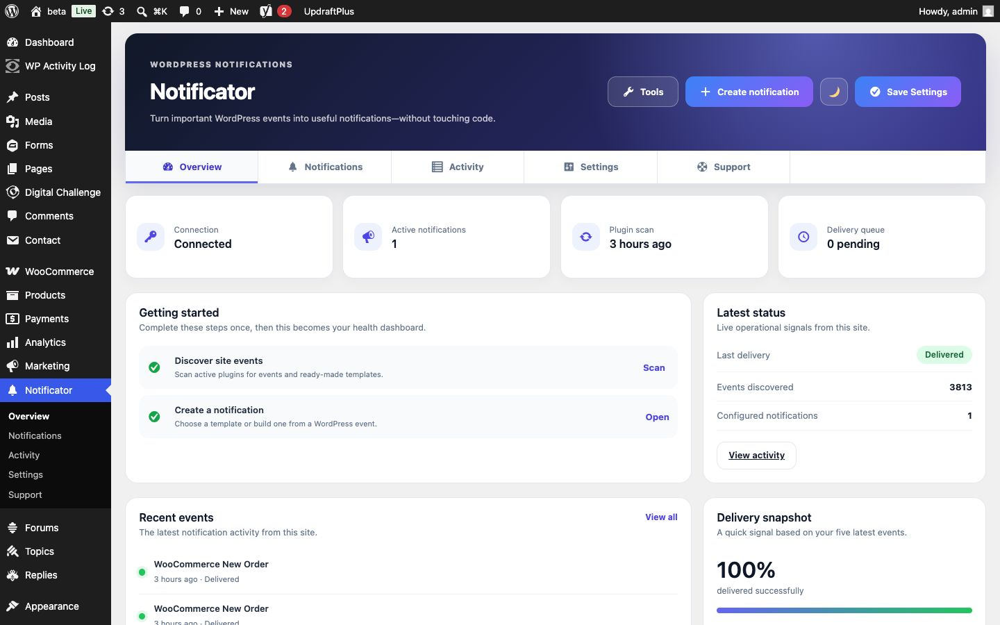
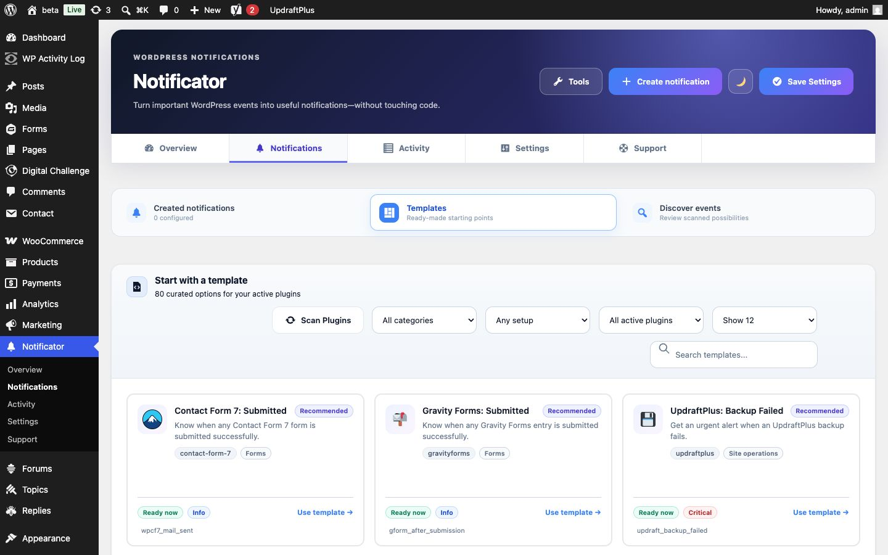
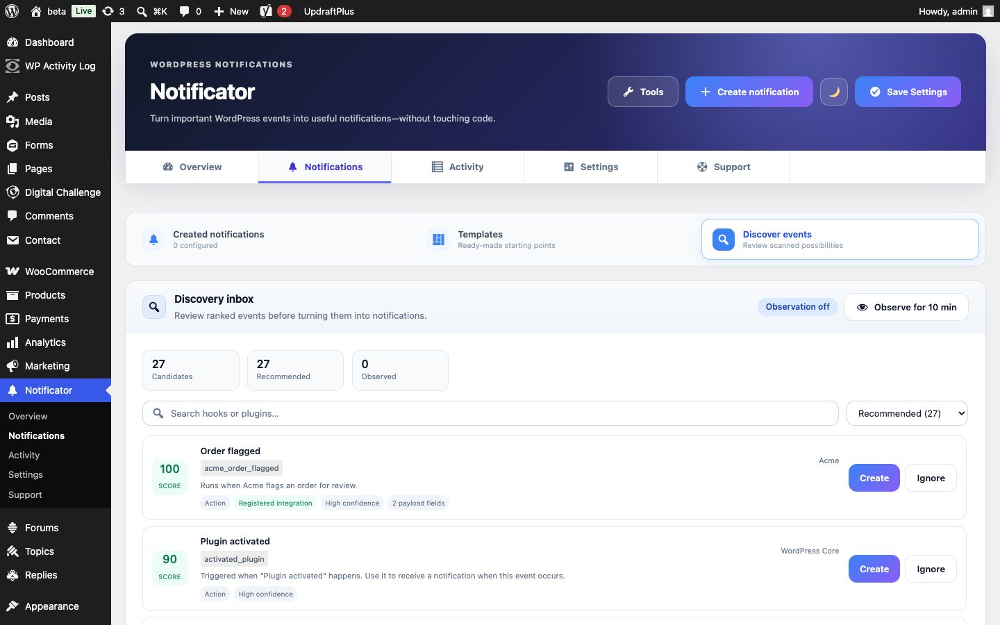
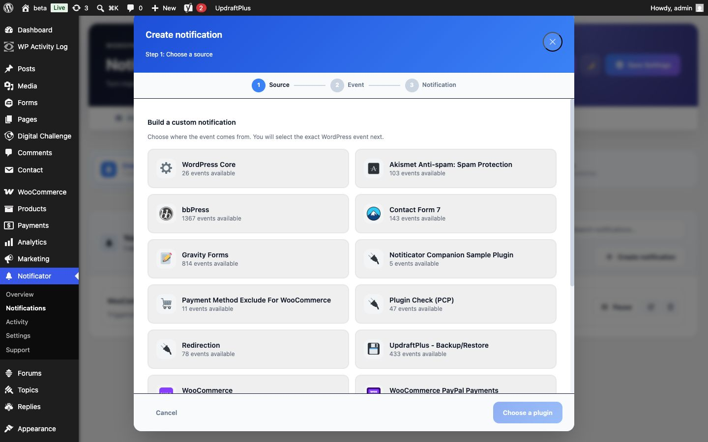

# Notificator – Alerts & Notifications

Notificator turns meaningful WordPress events into dashboard alerts, optional mobile push notifications, and MQTT messages. Administrators can discover events, apply curated templates, build conditions, review delivery activity, and export configurations for reuse on other sites.

This repository contains the Notificator WordPress plugin, its development tooling, and an installable integration example.

This guide covers setup and everyday use first, followed by architecture, development, integration, and release documentation. WordPress.org listing content is maintained separately in [`readme.txt`](./readme.txt), as required by the directory.

## Contents

- [Requirements](#requirements)
- [What Notificator does](#what-notificator-does)
- [Installation](#installation)
- [Getting started](#getting-started)
- [Accounts and remote delivery](#accounts-and-remote-delivery)
- [Configuration portability](#configuration-portability)
- [Data, privacy, and uninstall](#data-privacy-and-uninstall)
- [Screenshots](#screenshots)
- [Repository map](#repository-map)
- [Architecture](#architecture)
- [Development and builds](#development-and-builds)
- [Quality and releases](#quality-and-releases)
- [Integration API](#integration-api)
- [Template API](#template-api)
- [Extension hooks](#extension-hooks)
- [Support and license](#support-and-license)

## Requirements

- WordPress 5.0 or newer
- PHP 7.2 or newer
- The `manage_options` capability to configure the plugin

An API key is optional. Event discovery, notification configuration, dashboard alerts, activity logging, templates, imports, and exports work locally. Mobile push and MQTT require a Notificator account and an enabled API key.

## What Notificator does

- Discovers actions and filters in WordPress Core and installed plugins.
- Ranks likely events using source, confidence, risk, and noise information.
- Provides ready-made templates and a guided custom-notification builder.
- Delivers each notification to the WordPress dashboard, mobile push, MQTT, or a combination.
- Supports conditions, placeholders, priority, and throttling.
- Records bounded delivery activity for troubleshooting.
- Exports and imports notification configurations as JSON.
- Lets plugins and themes register reliable events and templates without scanning.

## Installation

1. Download the current ZIP from the [GitHub Releases page](https://github.com/notificator-project/WordPress-Plugin/releases).
2. In WordPress, open **Plugins → Add New Plugin → Upload Plugin**.
3. Select the downloaded ZIP, choose **Install Now**, and activate Notificator.
4. Open **Notificator → Overview** to begin setup.

For a manual installation, extract the archive into `wp-content/plugins/`. The resulting plugin entry file should be `wp-content/plugins/notificator-project/notificator-project.php`.

### Events, templates, and notifications

These terms represent different stages:

- An **event** is something that can happen in WordPress, such as a user signing in or an order changing status. Discovering or registering an event does not monitor it.
- A **template** is an editable starting configuration for an event. Applying a template opens a draft.
- A **notification** is a saved rule that listens for an event. Only enabled notifications can create alerts.

## Getting started

1. Install and activate Notificator.
2. Open **Notificator → Overview** in wp-admin.
3. Select **Scan plugins** to discover events, or use an explicitly registered event immediately.
4. Apply a template or create a notification from a discovered event.
5. Keep **Dashboard** enabled for local WordPress alerts.
6. Optionally connect an API key and enable Mobile push or MQTT.

### Hook discovery

Scanning is local and resumable. It processes plugins in background batches, prevents overlapping scans, bounds per-plugin work, reuses unchanged results, and leaves the previous discovery snapshot available until the replacement is complete.

Static discovery is advisory: it can identify literal `do_action()` and `apply_filters()` calls and infer payload names, but cannot prove runtime behavior. Results therefore record whether a hook is emitted or only registered, whether its name is literal or dynamic, confidence, risk, selectability, source location, and best-effort payload metadata.

Optional observation samples execution counts, argument types, and context without storing argument values. Explicit third-party registration has higher authority than static inference.

## Accounts and remote delivery

Dashboard alerts do not require an account. To use mobile push or MQTT:

1. Search for **Notificator** in the [Apple App Store](https://apps.apple.com/) or [Google Play Store](https://play.google.com/store).
2. Install the mobile app and create an account.
3. Create an API key in the app.
4. Add and enable the key under **Notificator → Settings**.
5. Enable Mobile push or MQTT on the relevant notifications.

The optional remote service endpoint is `https://wpnotif.notificator-project.com`. It is contacted only when an administrator tests a key, an enabled notification requests remote delivery, or a previously configured website monitor is sent to the service. The plugin does not load executable code or visual assets from a remote service.

Requests can include the enabled API key, site origin, timestamp, nonce, HMAC signature, notification content and metadata, selected channels, site and version information, administrator-configured placeholder values, and the name, URL, method, and enabled state of a configured website monitor. Raw hook arguments, database contents, and exported configurations are not sent wholesale.

The service validates API keys and allowed domains. Notification content may be encrypted with the account's public key and stored in Supabase for use by the Notificator app. Depending on the enabled channels and account settings, delivery can use Expo for mobile push, HiveMQ for MQTT, and Resend for email. See the [Notificator documentation](https://docs.notificator-project.com/) for current service and privacy information.

## Configuration portability

Use **Tools → Export** to download configured notifications as JSON. Import that file on another site and choose whether to merge it with or replace the destination configuration.

API keys are not exported. After an import, review plugin availability, hook names, placeholders, conditions, keys, and delivery channels before enabling notifications.

## Data, privacy, and uninstall

Notificator does not add advertising or analytics tracking. It stores settings, notifications, discovery metadata, activity history, dashboard-alert data, health summaries, and temporary delivery jobs in WordPress. Discovery snapshots can be stored in the protected uploads `notificator/` directory.

Remote delivery is opt-in per notification. Rendered placeholders become part of notification content and may contain personal information, so administrators should avoid unnecessary sensitive values.

Deactivation preserves configuration. Deleting the plugin through WordPress removes all plugin-owned settings, notifications, activity, scan caches, scheduled jobs, user metadata, and transients, including across multisite. The in-plugin test reset can preserve API keys.

## Screenshots

| Overview                                                                                                              | Templates                                                                                                               |
| --------------------------------------------------------------------------------------------------------------------- | ----------------------------------------------------------------------------------------------------------------------- |
|  |  |

| Event discovery                                                                                                           | Notification builder                                                                                                    |
| ------------------------------------------------------------------------------------------------------------------------- | ----------------------------------------------------------------------------------------------------------------------- |
|  |  |

## Repository map

```text
plugin/
├── notificator-project.php         Plugin bootstrap and runtime orchestration
├── admin/class-admin-page.php      Admin rendering and asset setup
├── includes/
│   ├── class-plugin-scanner.php    Static discovery and scan persistence
│   ├── class-delivery-queue.php    Immediate delivery and retry queue
│   └── class-health-service.php    Operational health summaries
├── assets/
│   ├── js/                         Scenario builder and template catalogue
│   ├── src/                        Vite entry points, toast client, and styles
│   └── dist/                       Generated production assets
├── examples/                       Installable integration example
├── scripts/build-release.sh        Reproducible release packager
├── readme.txt                      Required WordPress.org documentation
└── uninstall.php                   Multisite-aware data cleanup
```

## Architecture

### Runtime ownership

1. `notificator-project.php` defines public registration functions, loads runtime classes, and creates the singleton plugin instance.
2. `Notificator_Companion` registers hooks, sanitizes settings, attaches configured listeners, evaluates conditions, and coordinates delivery.
3. `Notificator_Companion_Admin_Page` renders the six admin workspaces and supplies server-owned state and nonces to compiled assets.
4. `Notificator_Companion_Plugin_Scanner` discovers hook emitters and persists a bounded, versioned snapshot.
5. `Notificator_Companion_Delivery_Queue` attempts remote delivery immediately and schedules single WP-Cron events only for transient retries.
6. `Notificator_Companion_Health_Service` stores small operational summaries for Overview.

### Notification path

```text
WordPress action
    → configured listener
    → condition evaluation
    → throttle decision
    → placeholder rendering
    ├── dashboard queue
    ├── activity log
    └── remote delivery queue
            → Notificator API
            ├── mobile push
            └── MQTT
```

Dashboard delivery is local. Push and MQTT are skipped unless the notification enables them and at least one active key exists.

### Persistence

| Data                       | Storage                                         | Notes                                       |
| -------------------------- | ----------------------------------------------- | ------------------------------------------- |
| Settings and notifications | `notificator_companion_settings` option         | Keys, channels, conditions, and preferences |
| Activity                   | `notificator_companion_notification_log` option | Bounded, non-secret delivery history        |
| Dashboard alerts           | `notificator_companion_admin_toasts` option     | Bounded local queue                         |
| Delivery retries           | `notificator_companion_delivery_queue` option   | Removed after a terminal result             |
| Health summary             | `notificator_companion_health` option           | Scan, test, and delivery status             |
| Discovery snapshot         | uploads `notificator/scanned-hooks.json`        | Versioned JSON protected from browsing      |
| Rate limits                | WordPress transients                            | Hash-suffixed keys removed during uninstall |

### Admin boundary

PHP owns capabilities, nonces, sanitization, persisted state, and authoritative availability. TypeScript owns interaction, progressive enhancement, modal state, and local presentation. Client-side disabled states are usability features, never security controls.

- `assets/src/admin.ts` is the primary admin entry point.
- `assets/js/scenario-templates.ts` contains the typed built-in catalogue.
- `assets/js/admin-scenarios.ts` manages the Alpine-powered builder and scan workflow.
- `assets/src/admin-toast.ts` is the independent WordPress-admin alert client.

Generated files under `assets/dist/` must never be edited manually.

### Stable interfaces

These are versioned public interfaces:

- public functions beginning with `notificator_companion_`;
- documented actions and filters;
- option names and serialized notification keys;
- import/export schema fields;
- AJAX action names used by released admin bundles.

Treat changes to these interfaces as versioned API or data-schema changes.

## Development and builds

Run commands from the `plugin/` directory.

Development requires Node.js 20 or newer and Composer 2.

Install dependencies:

```bash
npm install
composer install
```

Start the Vite development server:

```bash
npm run dev
```

Build production admin assets:

```bash
npm run build
```

This produces:

- `assets/dist/admin.css`
- `assets/dist/admin.js`
- `assets/dist/admin-toast.css`
- `assets/dist/admin-toast.js`

Build with source maps for local debugging:

```bash
npm run build:debug
```

Source maps are excluded from releases. WordPress loads the compiled files when all required bundles exist. A source checkout with missing bundles must be rebuilt; distributed releases always contain them.

Format frontend sources, build configuration, and PHP:

```bash
npm run format
```

Prettier formats TypeScript, CSS/SCSS, and configuration. PHPCBF formats PHP when Composer dependencies are installed.

## Quality and releases

Run the complete preflight:

```bash
npm run check
npm audit
composer audit
```

`npm run check` verifies Prettier, ESLint, Stylelint, PHP syntax, WordPress Core, WordPress Docs, WordPress Extra, PHPCompatibilityWP, strict TypeScript, and both production bundles.

Build the installable plugin and sample-integration archives:

```bash
npm run build:release
```

The primary artifact is `dist/notificator-project.zip`. The release process formats sources, runs the full preflight, rebuilds assets, copies only runtime files, verifies required bundles, excludes development artifacts, and validates the ZIP.

A release is acceptable only when:

- all automated checks pass;
- `readme.txt` and the plugin-header version match;
- the ZIP contains one top-level `notificator/` directory;
- no source maps, dependencies, backup files, operating-system files, or secrets are packaged;
- uninstall behavior matches the documented lifecycle;
- the final ZIP passes the official WordPress Plugin Check plugin.

### Code conventions

- PHP follows WordPress Core, Docs, and Extra standards and supports PHP 7.2+.
- Public APIs, stored keys, hooks, and import/export fields are versioned interfaces.
- Document intent, privacy boundaries, invariants, and payload shapes rather than syntax.
- Normalize values explicitly at PHP and JavaScript boundaries.
- TypeScript under `assets/src/` is strict. Add new behavior in focused typed modules.
- Escape toast content as text by default. Only Notificator-produced escaped markup may use trusted HTML.
- Keep admin mutations capability-checked, nonce-protected, sanitized on input, and escaped on output.

### Security checklist

- Verify capabilities before every privileged action.
- Verify a purpose-specific nonce before processing request data.
- Apply `wp_unslash()` before sanitizing WordPress request values.
- Escape at output according to context; do not pre-escape stored values.
- Never log, export, or interpolate API keys.
- Keep remote request bodies bounded and JSON encoded.
- Treat discovered payloads as untrusted.
- Allow object methods only when trusted metadata explicitly declares them.

## Integration API

Notificator can statically discover ordinary WordPress hooks, but explicit event registration is faster, more accurate, and immediately available.

Register definitions when Notificator requests them so plugin load order does not matter:

```php
add_action(
	'notificator_companion_register_events',
	function () {
		if ( ! function_exists( 'notificator_companion_register_event' ) ) {
			return;
		}

		notificator_companion_register_event(
			array(
				'hook_name'   => 'acme_order_flagged',
				'label'       => 'Order flagged',
				'description' => 'Runs when Acme flags an order for manual review.',
				'plugin_slug' => 'acme',
				'plugin_name' => 'Acme',
				'plugin_file' => plugin_basename( __FILE__ ),
				'arg_names'   => array( 'order_id', 'reason' ),
			)
		);
	}
);
```

Emit the event through WordPress:

```php
do_action( 'acme_order_flagged', $order_id, $reason );
```

The event appears under **Notifications → Discover events** without a scan.

### Event definition

| Key           | Required | Description                                                   |
| ------------- | -------- | ------------------------------------------------------------- |
| `hook_name`   | Yes      | Exact, stable, prefixed WordPress action name                 |
| `label`       | No       | Human-readable name generated from the hook when omitted      |
| `description` | No       | Plain-language explanation of when the event fires            |
| `plugin_slug` | No       | Stable integration slug; defaults to `custom-integrations`    |
| `plugin_name` | No       | Product name shown in the admin interface                     |
| `plugin_file` | No       | Plugin basename, normally `plugin_basename( __FILE__ )`       |
| `arg_names`   | No       | Ordered names matching arguments passed to `do_action()`      |
| `properties`  | No       | Safe object-property metadata for conditions and placeholders |

Registration returns `true` when accepted and `false` when invalid. Registering the same `plugin_slug` and `hook_name` replaces the earlier definition, preventing duplicate cards.

### Payload and privacy guidance

- Pass IDs, statuses, totals, and short operational values useful for conditions.
- Never pass secrets, passwords, tokens, complete payment details, or unnecessary personal data.
- Raw hook arguments are not automatically sent remotely; selected values are rendered only through configured placeholders or conditions.
- Keep argument order stable after publishing an integration.

## Template API

Templates are reusable starting points under **Notifications → Templates**. Applying one opens the notification builder with defaults; it does not create or send an alert until an administrator saves it.

Register templates on the load-order-safe registration action:

```php
add_action(
	'notificator_companion_register_templates',
	function () {
		if ( ! function_exists( 'notificator_companion_register_template' ) ) {
			return;
		}

		notificator_companion_register_template(
			array(
				'icon'            => 'dashicons-flag',
				'title'           => 'Acme: order needs review',
				'hook_name'       => 'acme_order_flagged',
				'description'     => 'Alert an administrator when Acme flags an order.',
				'scenario_name'   => 'Order needs review',
				'required_plugin' => 'acme',
				'hook_meta'       => array(
					'label'         => 'Order flagged',
					'type'          => 'action',
					'arg_names'     => array( 'order_id', 'reason' ),
					'payload_arity' => 2,
				),
				'conditions'      => array(
					array(
						'field'       => 'reason',
						'operator'    => 'contains',
						'value'       => 'manual review',
						'value_label' => 'Reason contains',
					),
				),
			)
		);
	}
);
```

### Template fields

| Field             | Required | Purpose                                                           |
| ----------------- | -------- | ----------------------------------------------------------------- |
| `title`           | Yes      | Short template-card title                                         |
| `hook_name`       | Yes      | Exact action the saved notification listens to                    |
| `description`     | Yes      | Plain-language explanation of the outcome                         |
| `scenario_name`   | Yes      | Default name placed in the builder                                |
| `required_plugin` | Yes      | Stable integration slug used for visibility                       |
| `icon`            | No       | Emoji or Dashicon class                                           |
| `hook_meta`       | No       | Label, action type, ordered arguments, arity, and safe properties |
| `conditions`      | No       | Editable conditions prefilled in the builder                      |

Use the same value for the event’s `plugin_slug` and template’s `required_plugin`. Registered events automatically make their template group visible.

For template-only integrations, expose the slug explicitly:

```php
add_filter(
	'notificator_companion_active_plugin_identifiers',
	function ( $identifiers ) {
		$identifiers[] = 'acme';
		return $identifiers;
	}
);
```

Use `wordpress-core` only when a template genuinely applies without another plugin.

### Template design guidance

- Describe the operational outcome rather than the implementation hook.
- Prefer a few high-value templates over every possible event.
- Keep defaults understandable and safe for non-developers.
- Match `arg_names` to the exact `do_action()` argument order.
- Treat public hook names and payload order as versioned contracts.

An event definition documents what an integration emits; a template suggests a useful configuration. Neither creates a notification. Integrations can provide either or both.

The installable example at [`examples/notificator-sample-plugin/`](./examples/notificator-sample-plugin/) demonstrates event registration, a matching template, named payload fields, and a nonce-protected trigger.

## Extension hooks

- `notificator_companion_register_events` — registration point for event definitions.
- `notificator_companion_registered_events` — filters normalized registered definitions.
- `notificator_companion_register_templates` — registration point for templates.
- `notificator_companion_templates` — filters the final template library.
- `notificator_companion_active_plugin_identifiers` — extends template visibility.
- `notificator_companion_api_endpoint` — replaces the remote delivery endpoint.
- `notificator_companion_scanner_hook_emitters` — adds scanner emitter functions.
- `notificator_companion_scan_hook_limit` — adjusts the bounded per-plugin discovery limit.

## Support and license

Notificator is free and open source. Current functionality is intended to remain free; optional future features or hosted services will not remove the functionality available today.

Support development through [Buy Me a Coffee](https://buymeacoffee.com/vagelis) or [GitHub Sponsors](https://github.com/sponsors/vagelisp). Donations do not unlock features or priority support. You can also [contact the project](https://notificator-project.com/contact/).

For reproducible bugs and feature requests, open a [GitHub issue](https://github.com/notificator-project/WordPress-Plugin/issues) with the WordPress, PHP, and plugin versions, steps to reproduce, expected and actual behavior, and any relevant logs or screenshots. Do not include API keys or other secrets.

Licensed under GPL-3.0-or-later. See the plugin header and WordPress.org `readme.txt` for release metadata.
